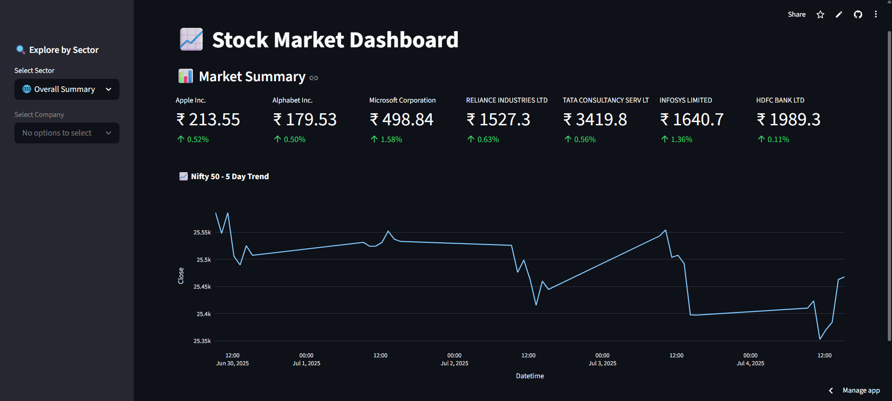

### 📊 Stock Market Dashboard

A beginner-friendly and responsive **Sector-Wise Stock Market Dashboard** built using **Python**, **Streamlit**, and **YFinance API**. This dashboard helps users explore live stock data sector-wise with simplified visuals and summaries.

---

### 🚀 Features

* 🔍 **Sector-based stock filtering**
* 📈 **Live stock prices** and trend graphs
* 🔗 **Quick access to Yahoo Finance** for full stock details
* 📊 **Nifty 50 trend** visualization
* 💡 Simple and user-friendly UI

### 🛠 Tech Stack

* Python 🐍
* [Streamlit](https://streamlit.io/)
* [YFinance](https://pypi.org/project/yfinance/)
* Plotly Express 📊
* Pandas

---

### 📸 Preview

 

